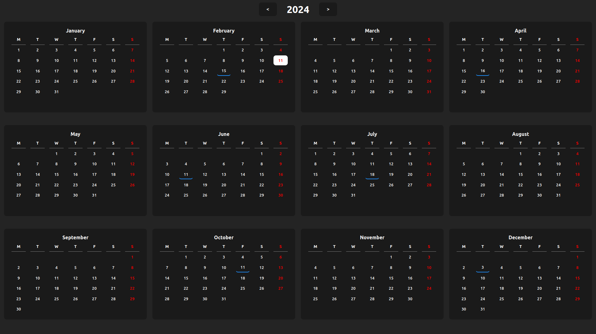
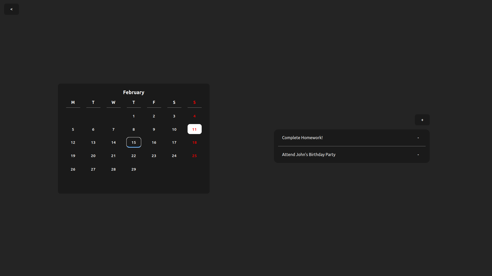

# Calendar

This is a simple calendar web app built using React.js. Users can manage their events on the calendar. Try it out [here]().

## Features

- Days with events are marked with a blue underline.

- See a list of the events on a particular day by clicking on it in the calendar.

- Add an event by pressing the "+" button.

- Delete events by clicking the "-" beside them in the list of events.